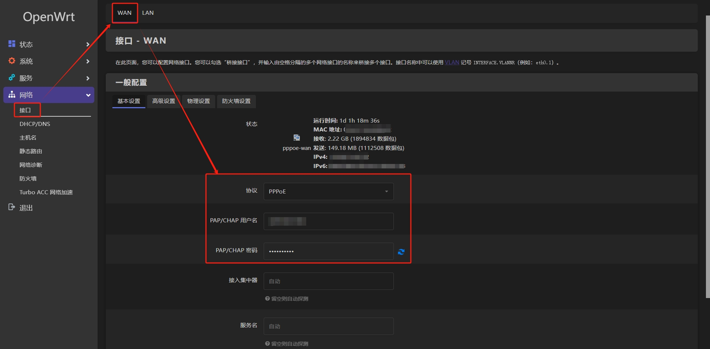
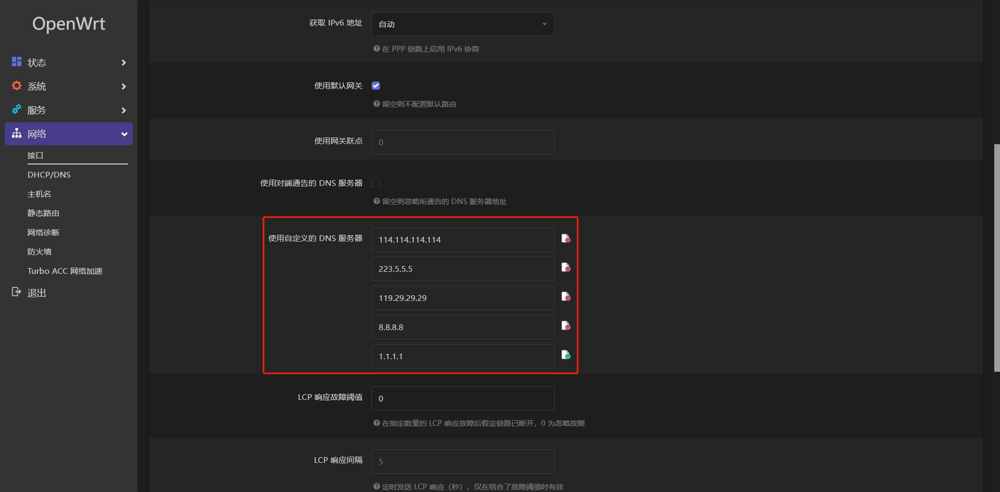
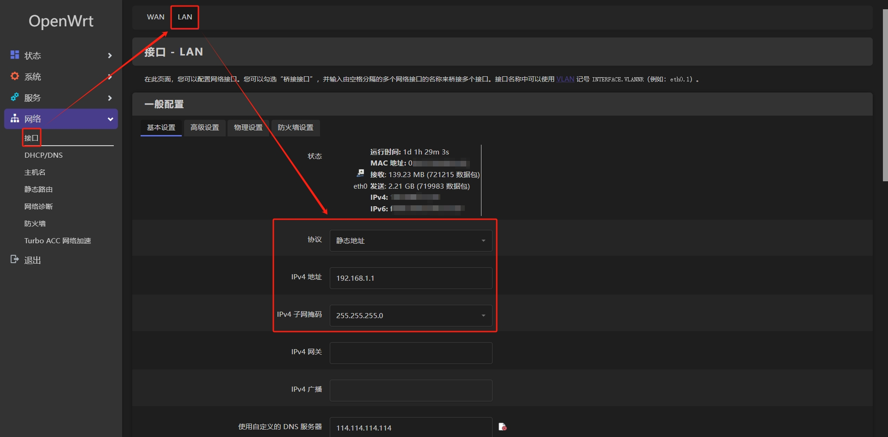
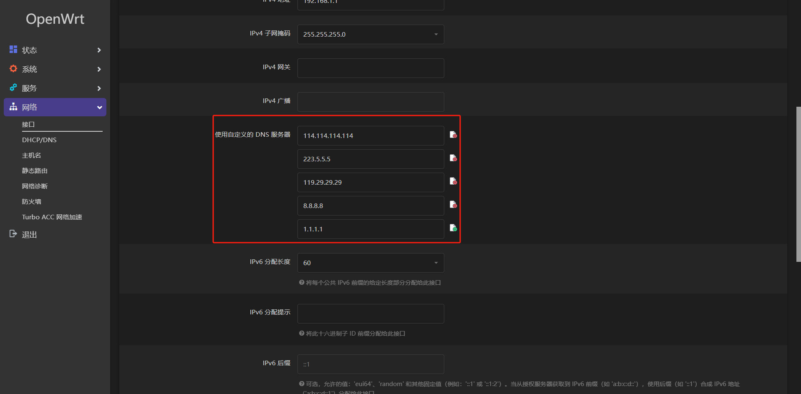
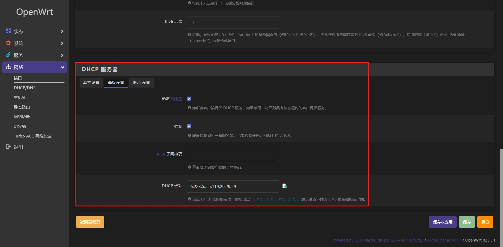

# OpenWRT in Docker

本项目介绍如何在 **Docker** 中运行 **OpenWRT**，并将其作为主路由使用。

## 准备工作

- 将光猫设置为 **桥接** 模式，具体可咨询当地运营商，路由器设置为 [*PPPoE*](https://en.wikipedia.org/wiki/Point-to-Point_Protocol_over_Ethernet) 模式（后面会改为 **AP** 模式）。
- 一台运行 **Linux**（推荐 [Arch](https://archlinux.org)）操作系统的设备，*ARM/x86* 均可，已安装 **Docker**；最好能有两个千兆以上的物理网口（可以用 *USB* 网卡代替），假设名称分别为 ***openwrt-wan*** 和 ***openwrt-lan***，在当前网络中的 *IP* 分别为 `192.168.1.10`，`192.168.1.20`。
- 在后续的步骤中，我们会将 ***openwrt-wan*** 连接光猫，作为 ***wan*** 口使用，提供 [*PPPoE*](https://en.wikipedia.org/wiki/Point-to-Point_Protocol_over_Ethernet) 拨号等服务；***openwrt-lan*** 连接路由器，作为 ***lan*** 口使用，提供 [*DHCP*](https://en.wikipedia.org/wiki/Dynamic_Host_Configuration_Protocol) 等服务。
- 我们假设光猫的 *IP* 为 `192.168.0.1`，*CIDR* 为 `192.168.0.0/24`，***openwrt-lan*** 作为 ***lan*** 口的 *IP* 为 `192.168.1.1`，*CIDR* 为 `192.168.1.0/24`，只要两边的 *IP* 不在同一个网段即可。

以下配置根据实际情况修改：
- 如果要修改网口名称，需同步修改 [*openwrt-lan.sh*](bin/openwrt-lan.sh)，[*openwrt-lan.service*](conf/openwrt-lan.service)，[*docker-compose.yml*](docker-compose.yml) 中相应的配置项。  
- 如果要修改 *IP*，需同步修改 [*openwrt-lan.sh*](bin/openwrt-lan.sh)，[*docker-compose.yml*](docker-compose.yml) 中相应的配置项。  
- 文档使用的是 *x86* 架构的设备，如果你使用的是 *ARM* 架构的设备，可能需要修改 [*docker-compose.yml*](docker-compose.yml) 中的镜像。

> 注：需要使用 [*systemd-networkd*](https://wiki.archlinux.org/title/Systemd-networkd) 作为 **Linux** 的网络配置工具。  

## 启动&配置

### 1. 打开网卡混杂模式
```shell
sudo ip link set openwrt-wan promisc on
sudo ip link set openwrt-lan promisc on
```

### 2. 启动 OpenWRT
```shell
sudo docker-compose up -d
```
如果启动失败，请根据日志排查错误。

### 3. 修改网络配置

#### 3.1 进入容器
```shell
sudo docker exec -it openwrt bash # openwrt 为容器名称
```

#### 3.2 修改 OpenWrt 网络配置文件
```shell
vim /etc/config/network
```
找到下面的配置项：
```
config interface 'lan'
        option ifname 'eth0'
        option proto 'static'
        option ipaddr '192.168.1.1'
        option netmask '255.255.255.0'
        option ip6assign '60'
        option dns '114.114.114.114 223.5.5.5 119.29.29.29 8.8.8.8 1.1.1.1'
```
只需要修改 *option ipaddr* 字段，将其修改为 ***lan*** 口的 *IP* 即可，本教程中为 `192.168.1.1`。

#### 3.3 重启网络
```shell
/etc/init.d/network restart
```

#### 3.4 调整路由器配置
将路由器设置为 **AP** 模式

#### 3.5 WAN/LAN 口配置调整
在浏览器中输入 ***lan*** 口的 *IP* 进入 *Luci* 控制面板，用户名：`root`，密码：`password`。  
在 *Web* 控制面板，将 ***wan*** 口协议设置为 *PPPoE*，并使用自定义的 *DNS*，如下图所示：



将 ***lan*** 口协议设置为 *静态地址*，并使用自定义的 *DNS*，然后调整 *DHCP* 服务器配置项，如下图所示：




> 建议 ***wan***、***lan*** 口都使用自定义的 *DNS*。

#### 3.6 服务/插件配置
**OpenWrt** 强大的插件功能让其可玩性到了新的高度，包括但不限于广告屏蔽、各种协议的网络代理等；介于某些原因，这一块请大家自己探索，并享受其中的乐趣！

## 宿主机网络修复

**OpenWrt** 容器运行后，**Linux** 宿主机与 **OpenWRT** 之间无法直接通信，导致宿主机无法访问互联网，局域网内其他设备也无法直接访问宿主机。这和 **Docker** 的 *macvlan* 网络驱动模式有关，这个模式通俗一点讲就是在一张物理网卡上模拟出一张虚拟网卡，有独立的 *MAC* 地址，可以分配独立的 *IP* 地址，看起来就像是局域网内一台独立的设备；此时 **Docker** 容器可以和局域网下的设备直接通信，反之亦然，很方便。不过，这种模式有一个问题：宿主机和容器是没办法直接网络通信的，也即最开始提到的问题。  

幸运的是，网上有大佬给出了一些解决方案，我整理成了一个简单的 [*脚本*](bin/openwrt-lan.sh)，并作为 [*systemd*](https://wiki.archlinux.org/title/Systemd) 服务运行。 在启动该守护进程前，请根据实际情况修改 [*openwrt-lan.sh*](bin/openwrt-lan.sh) 和 [*openwrt-lan.service*](conf/openwrt-lan.service)。

## 感谢

- [在 Docker 中运行 OpenWrt 旁路网关](https://mlapp.cn/376.html)
- [macvlan 模式容器与宿主机通信](https://aoyouer.com/posts/macvlan-host/)
